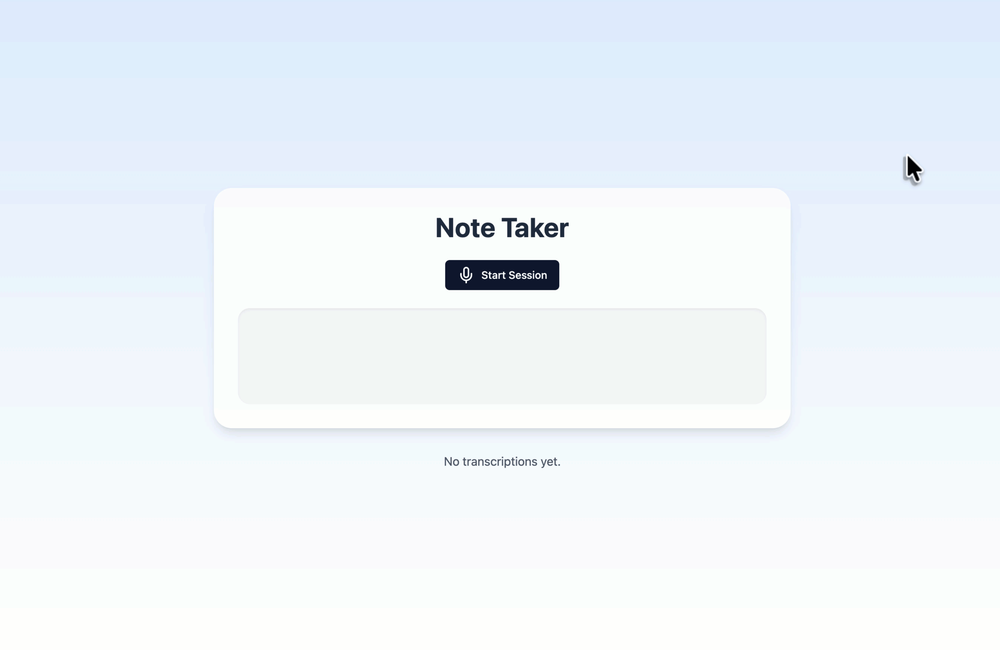

# Note Taker App

Welcome to the Note Taker App! 🎤📝

This app lets you record voice notes, transcribe them in real-time, and get handy summaries and next steps generated by OpenAI's GPT model. It's simple, intuitive, and perfect for capturing your thoughts on the go.



## Features

- **Real-Time Transcription**: Speak, and watch your words appear instantly.
- **AI-Powered Summaries**: Get concise summaries, titles, and actionable next steps for your notes automatically.
- **Local Storage**: All your notes are saved in your browser—no accounts or logins needed.
- **Responsive Design**: Works great on both desktop and mobile devices.
- **OpenAI Integration**: Seamlessly connects with OpenAI's Realtime API for fast and accurate transcription.

## Getting Started

### Prerequisites

- **Node.js**: Make sure you have Node.js installed (version 18 or above).
- **OpenAI API Key**: You'll need an API key from OpenAI (must start with `sk-`).

### Installation

1.  **Clone the repository:**
    ```bash
    git clone <repository-url>
    cd Note-Taker
    ```

2.  **Install dependencies:**
    ```bash
    npm install
    ```

3.  **Run the development server:**
    ```bash
    npm run dev
    ```

4.  **Open the app:**
    Navigate to [http://localhost:3000](http://localhost:3000) in your browser.

5.  **Configure Settings:**
    Click the settings icon in the app and enter your OpenAI API key to start recording.

    


